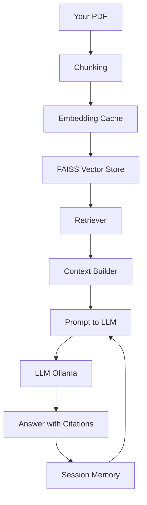

# RAG v0.4 — Memory, Metadata & Embedding Cache

This repository implements **v0.4** of a Retrieval-Augmented Generation (RAG) system, extending a
multi-PDF, citation-backed pipeline with **session-level memory**, **deterministic metadata**, and
**embedding reuse**.

The focus of this version is **architectural correctness**, not UI or APIs.

---

## 🚀 Features

### ✅ Multi-PDF RAG with Citations
- Ingest multiple PDFs
- Chunk-level retrieval
- Answers include explicit citations

### ✅ Session-Level Conversational Memory
- Maintains contextual continuity across questions
- Enables follow-ups like *“explain it simpler”* or *“what about the previous concept”*
- Memory is **prompt-level**, **session-scoped**, and **non-persistent**

### ✅ Deterministic Metadata
Each chunk contains:
- `source` — originating document
- `page` — page number
- `chunk_id` — stable identifier (`source__page__index`)

This ensures traceability and prepares the system for advanced filtering and evaluation.

### ✅ Embedding Cache (In-Memory)
- Each chunk generates a stable `embedding_key` (SHA-256 hash of content)
- Embeddings are reused within a run if content is unchanged
- Prevents redundant embedding computation

---

## 🧱 Architecture Overview

PDFs
↓
Chunking (chunk_id + embedding_key)
↓
FAISS Vector Store (persistent)
↓
Retriever
↓
LLM
↑
Session Memory (prompt-level)


Key design principle:
> **Retrieval finds facts. Memory preserves understanding.**

---

## 📂 Project Structure
```
    rag-v0.4-memory/
    ├── main_ingest.py # PDF ingestion & indexing
    ├── main_qa.py # Interactive Q/A loop
    ├── core/
    │ ├── chunker.py # Chunking + deterministic metadata + embedding_key
    │ ├── vector_store.py # FAISS store + in-memory embedding cache
    │ ├── qa.py # Answer generation with citations + memory injection
    │ ├── memory.py # Session-level conversational memory (v0.4)
    │ ├── retriever.py # Retriever wrapper
    │ ├── embeddings.py # Embedding model loader
    │ ├── citations.py # Citation formatting logic
    │ └── init.py
    └── vector_store/ # Persistent FAISS index
```
---

## 🖼️ System Flow (Pictorial View)

---

## 🧠 How to **read this diagram**
- **Top → bottom** = data flow
- **Left loop (H → G)** = conversational memory
- **Bottom loop (J → H)** = memory update after each answer
- Retrieval path is **unchanged** by memory

This now renders **100% correctly on GitHub**.

---

## ▶️ How to Run

### 1. Activate virtual environment
```bash
.\.venv\Scripts\activate
```

### 2. Ingest PDFs

python main_ingest.py

### 3. Start Q/A session

python main_qa.py

- Ask multiple related questions in one session to observe memory behavior.

### 🔬 What This Version Does Not Do (By Design)

    ❌ No FastAPI / web server
    ❌ No LangGraph
    ❌ No persistent memory
    ❌ No disk-based embedding cache
    ❌ No evaluation benchmarks

These are planned for later versions.

### 🎯 Motivation

This project is built to demonstrate clean RAG system evolution, with each version introducing
one architectural concept at a time. The code is intended to be:

- Diffable
- Explainable
- Interview-ready
